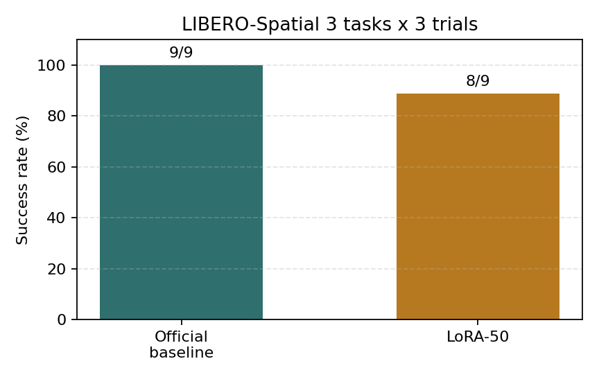
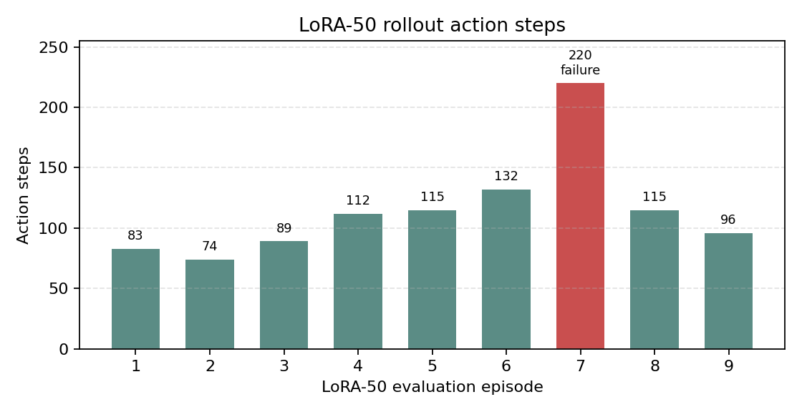
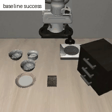
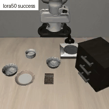
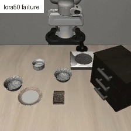

# OpenVLA + LIBERO 机器人操作任务评估与 LoRA 微调流程验证

## 项目概述

本项目围绕 Vision-Language-Action 模型 OpenVLA 在 LIBERO 机器人操作任务中的评估与小规模微调展开。项目在 H800 80GB 云端环境中完成 OpenVLA 官方 LIBERO-Spatial checkpoint 的加载、MuJoCo/robosuite 仿真 rollout、视频保存与日志记录，并进一步基于 LIBERO-Spatial RLDS 数据完成 LoRA 微调流程验证。

本项目的重点不是提出新模型，也不是声称刷新性能，而是完整打通“模型加载 -> 仿真评估 -> 可视化记录 -> RLDS/TFDS 数据读取 -> LoRA 训练 -> adapter 与 merged model 保存 -> 保存模型再评估”的工程闭环。

## 我完成了什么

- 在 H800 80GB 云端环境中搭建 OpenVLA + LIBERO 评估环境，并成功加载官方 `openvla-7b-finetuned-libero-spatial` checkpoint。
- 排查 LIBERO 长 rollout 中的 EGL/native abort 问题，确定 OSMesa 是当前云端环境下更稳定的渲染路径。
- 完成 official checkpoint 在 LIBERO-Spatial 小规模任务子集上的 baseline 评估：`3 tasks ? 3 trials = 9/9 success`。
- 准备 `libero_spatial_no_noops` RLDS/TFDS 数据，验证 OpenVLA `finetune.py` 可以读取数据并插入 LoRA adapter。
- 完成 LoRA no-save dry-run、save-smoke、保存模型再评估，以及 50-step LoRA 小规模训练。
- 记录训练指标、success rate、action steps、失败案例视频和实验日志，形成可追溯的实验闭环。

## 实验结果总览

| 实验阶段 | 设置 | 结果 | 说明 |
| --- | --- | --- | --- |
| Official checkpoint baseline | `libero_spatial`, OSMesa, 3 tasks ? 3 trials | 9/9 success | 作为本项目评估基线 |
| LoRA no-save dry-run | `max_steps=2`, `batch_size=1`, `save_steps=1000` | 成功 | 验证数据加载、LoRA 插入、forward/backward、optimizer step |
| LoRA save-smoke | `max_steps=2`, `save_steps=1` | 成功 | 保存 adapter 和 merged HF model |
| Save-smoke eval | 1 task ? 1 trial | success=True, 74 steps | 验证保存模型可被评估脚本加载 |
| LoRA-50 | `max_steps=50`, `batch_size=4`, `lora_rank=32` | 训练完成 | adapter 和 merged model 均保存 |
| LoRA-50 eval | 3 tasks ? 3 trials | 8/9 success | 完成微调后评估闭环，但未超过 official baseline |

## Official Checkpoint Baseline

baseline 使用官方 `openvla-7b-finetuned-libero-spatial` checkpoint，不做额外训练。评估环境为 LIBERO-Spatial、OSMesa 渲染、3 个 task、每个 task 3 次 trial。

| Task | Success rate | Action steps |
| --- | ---: | --- |
| black bowl between plate and ramekin ? plate | 3/3 | 81, 107, 77 |
| black bowl next to ramekin ? plate | 3/3 | 113, 95, 140 |
| black bowl from table center ? plate | 3/3 | 206, 103, 101 |

总体结果为 `9/9 success`。该结果作为后续 LoRA 小实验的比较基线。

## LoRA-50 小规模微调实验

LoRA-50 是在 official LIBERO-Spatial checkpoint 上继续做的极小步数 LoRA 训练，不是从 base OpenVLA 开始的完整微调复现实验。

训练设置：

| 参数 | 值 |
| --- | --- |
| base checkpoint | `openvla-7b-finetuned-libero-spatial` |
| dataset | `libero_spatial_no_noops` |
| max steps | 50 |
| batch size | 4 |
| LoRA rank | 32 |
| learning rate | `5e-4` |
| image augmentation | True |
| adapter size | about 463M |
| merged HF model size | about 15G |

baseline 与 LoRA-50 对比：

| 模型 / 实验 | 训练设置 | 评估设置 | 成功率 | 结论 |
| --- | --- | --- | --- | --- |
| Official checkpoint baseline | 官方 `openvla-7b-finetuned-libero-spatial`，无额外训练 | OSMesa, 3 tasks ? 3 trials | 9/9 | 本项目 baseline |
| LoRA-50 | 在 official checkpoint 上继续 LoRA 50 steps | 同一 3-task 评估子集 | 8/9 | 完成 LoRA 训练、保存、加载、评估闭环，但未超过 baseline |

任务级对比：

| Task | Official baseline | LoRA-50 | LoRA-50 action steps |
| --- | ---: | ---: | --- |
| black bowl between plate and ramekin ? plate | 3/3 | 3/3 | 83, 74, 89 |
| black bowl next to ramekin ? plate | 3/3 | 3/3 | 112, 115, 132 |
| black bowl from table center ? plate | 3/3 | 2/3 | 220, 115, 96 |

LoRA-50 没有超过 official checkpoint baseline。该结果说明，在已经针对 LIBERO-Spatial fine-tuned 的 checkpoint 上继续做极小步数 LoRA，可能会扰动已有策略。因此本项目将 LoRA-50 主要作为训练与评估闭环验证，而不是性能提升结论。

## 可视化结果

### 成功率对比



### LoRA-50 各 episode 动作步数



### Rollout 动图展示

原始 rollout MP4 保存在本地 `artifacts/rollouts/`。由于视频文件不纳入 Git 版本管理，README 中展示为轻量 GIF 动图。

#### Official checkpoint baseline 成功案例



#### LoRA-50 成功案例



#### LoRA-50 失败案例



| 类型 | 说明 |
| --- | --- |
| Official baseline success | 官方 checkpoint 成功完成抓取放置任务 |
| LoRA-50 success | LoRA-50 保存模型可被加载并完成 rollout |
| LoRA-50 failure case | episode 7，220 action steps 后未成功，用于分析小步数 LoRA 对已有策略的扰动 |

## 关键工程问题与解决

| 问题 | 现象 | 处理 |
| --- | --- | --- |
| HuggingFace 访问不稳定 | checkpoint 下载失败或连接中断 | 使用 HF mirror 和本地缓存，避免重复下载大模型 |
| FlashAttention 缺失 | 模型加载时报 attention backend 相关错误 | 切换到 PyTorch SDPA attention backend |
| TensorFlow GPU kernel 不兼容 | H800 上 TensorFlow 报 kernel 问题 | 使用 CPU TensorFlow，保留 PyTorch CUDA 负责模型推理与训练 |
| cuDNN conv2d engine 异常 | vision backbone forward 报错 | 禁用 cuDNN 路径绕过该问题 |
| EGL 渲染不稳定 | 长 rollout 中 native abort / core dumped | 切换到 OSMesa 渲染路径，并完成 100-step、200-step、full rollout 稳定性验证 |
| wandb/protobuf 异常 | `finetune.py` 顶层 import 失败 | 对 wandb 做 safe import，并在 disabled 模式下把训练指标打印到 stdout |

这些问题覆盖了模型加载、仿真渲染、训练日志、数据读取和云端 GPU 环境适配，体现了本项目的主要工程训练价值。

## 项目结构

```text
.
├── README.md
├── scripts/
│   ├── run_libero_eval.sh
│   ├── run_lora_finetune.sh
│   └── visualize_actions.py
├── notes/
│   ├── experiment_log.md
│   ├── lora_plan.md
│   ├── resume_bullets.md
│   └── environment_report.md
├── docs/
│   ├── figures/
│   └── media/
└── artifacts/        # 本地保存日志包和 rollout MP4，Git 忽略
```

`artifacts/`、`data/`、`external/`、`results/lora_runs/`、`results/lora_adapters_tmp/` 等目录包含大文件、外部依赖或实验产物，不提交到 Git。

## 复现实验说明

本项目的详细命令、环境检查、数据准备记录和实验日志保存在 `notes/` 目录中。README 只保留项目展示所需的关键信息。

复现实验时应使用 Linux 云端 GPU 环境。当前验证环境为 H800 80GB，本地 RTX 4060 Laptop 8GB 只用于代码开发、文档整理、可视化和 Git 管理，不建议运行 OpenVLA-7B 推理或 LoRA 微调。

复现实验前需要自行准备或确认：

- 官方 OpenVLA / LIBERO 依赖环境；
- official LIBERO-Spatial checkpoint；
- `libero_spatial_no_noops` RLDS/TFDS 数据；
- OSMesa 渲染路径；
- 足够的磁盘空间用于 checkpoint、adapter 和 merged model。

